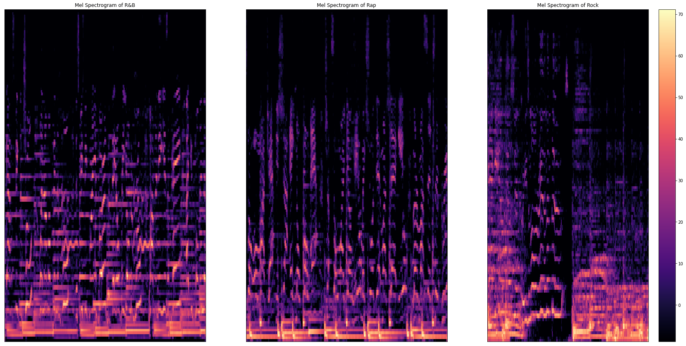

# Learning from Audio


Learning from Audio is a series of Medium articles written by Adam Sabra. Its main objective is to help those in the Data Science/Machine Learning field break into the audio domain starting from the basics of signal processing and build up towards more complex topics.

This GitHub repository will host the code and figures used within the articles.

# Important Note:
You will find a discrepancy between the Medium articles and the Jupyter notebooks. **I highly suggest using the Jupyter notebooks for more consistency.** 

I switched out the studied files from instrument sounds to high resolution snippets of different genres. **The published Medium articles still have the old data whereas the Jupyter notebooks have been updated.**

Furthermore, because of copyright issues, I am not allowed to share the snippets. However, I have created a command line interface via `snip_audio.py` for you to create your own snippets. Usage on the CLI will be below.

# Environment Creation
As you will see in the repository there is a `environment.yml` file. Please use this to set up your virtual environment and create a Jupyter kernel with the newly created environment. To create the environment, run the following: 

```
$ conda env create -f environment.yml
```

Once the environment has been created, simply activate it.

```
$ conda activate med-audio
```

If you do not know how to link an environment to a kernel, [this article will be useful for you.](https://towardsdatascience.com/link-your-virtual-environment-to-jupyter-with-kernels-a69bc61728df?)

# Create Snippets via Command Line

As mentioned before, I cannot share the snippets within the Jupyter notebooks. However, thanks to an issue being raised, I decided to create a quick and easy CLI for you to create your own snippets. The following tutorial assumes you are in the `med-audio` environment and in the repository's directory.

The required parameters are the following:

- `-p`: The path to the audio file being sliced. (`str`)
- `-n`: Name of the file to be saved. For your own sake, save it as something simple, such as `rb`, `song1`, etc. The `.wav` extension will be added for you already. (`str`)
- `-sr`: Sample rate of the audio to be loaded in. (`int`)
- `-sec`: Number of seconds you want the snippet to be. (`int`)

To run the file, simply run the following:

```
(med-audio)$ python3 snip_audio.py -p "path/to/song" -n "song1" -sr 22050 -sec 3 
```

The above example will save a new 3 second long file called `song1.wav` and it will be saved in the `snippets` directory.

# Links to Articles:
- [Learning from Audio: Wave Forms](https://towardsdatascience.com/learning-from-audio-wave-forms-46fc6f87e016#60b2-e67809770e17)
- [Learning from Audio: Time Domain Features](https://towardsdatascience.com/learning-from-audio-time-domain-features-4543f3bda34c)
- [Learning from Audio: Fourier Transformation](https://towardsdatascience.com/learning-from-audio-fourier-transformations-f000124675ee)
- [Learning from Audio: Spectrograms](https://towardsdatascience.com/learning-from-audio-spectrograms-37df29dba98c)
- [Learning from Audio: The Mel Scale, Mel Spectrograms, and Mel Frequency Cepstral Coefficients](https://towardsdatascience.com/learning-from-audio-the-mel-scale-mel-spectrograms-and-mel-frequency-cepstral-coefficients-f5752b6324a8)
- [Learning from Audio: Pitch and Chromagrams](https://towardsdatascience.com/learning-from-audio-pitch-and-chromagrams-5158028a505)

